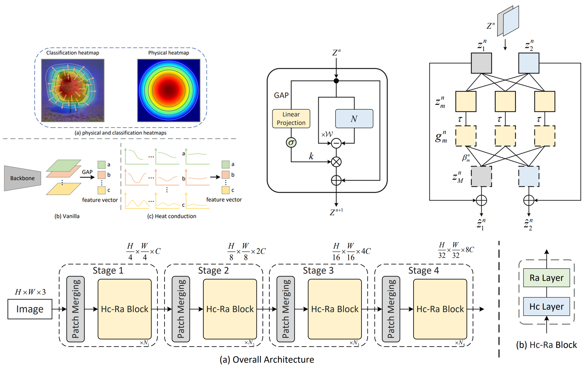
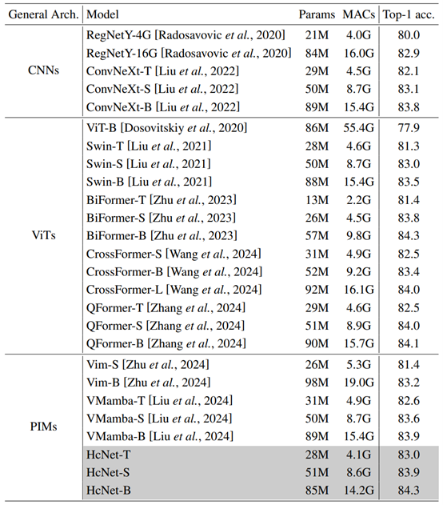
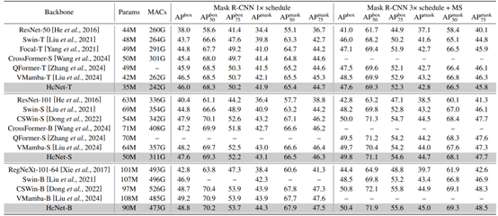
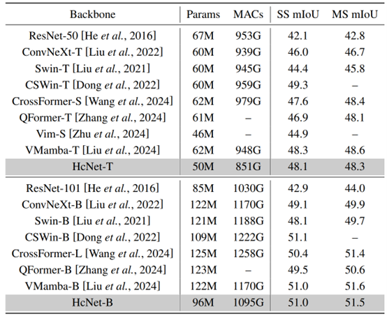

<div align="center">
<h1>HcNet</h1>
<h3>Efficient Visual Representation Learning with Heat Conduction Equation</h3>
<h3>(Accepted by IJCAI 2025)</h3>

Zhemin Zhang<sup>1</sup>, Xun Gong<sup>1</sup>

<sup>1</sup> Southwest Jiaotong University

Paper: ([2408.05901](https://arxiv.org/abs/2408.05901))

</div>

## Abstract
Foundation models, such as CNNs and ViTs, have powered the development of image representation learning. However, general guidance to model architecture design is still missing. Inspired by the connection between image representation learning and heat conduction, we model images by the heat conduction equation, where the essential idea is to conceptualize image features as temperatures and model their information interaction as the diffusion of thermal energy. Based on this idea, we find that many modern model architectures, such as residual structures, SE block, and feed-forward networks, can be interpreted from the perspective of the heat conduction equation. Therefore, we leverage the heat equation to design new and more interpretable models. As an example, we propose the Heat Conduction Layer and the Refinement Approximation Layer inspired by solving the heat conduction equation using Finite Difference Method and Fourier series, respectively. The main goal of this paper is to integrate the overall architectural design of neural networks into the theoretical framework of heat conduction. Nevertheless, our Heat Conduction Network (HcNet) still shows competitive performance, e.g., HcNet-T achieves 83.0% top-1 accuracy on ImageNet-1K while only requiring 28M parameters and 4.1G MACs.



## Introduction
This is an official implementation for "Efficient Visual Representation Learning with Heat Conduction Equation". This code is modified from [Swin Transformer](https://github.com/microsoft/Swin-Transformer). 

## Main Results

### **Classification on ImageNet-1K with HcNet**



### **Object Detection on COCO with HcNet**



* *Models in this subsection are initialized from the models trained in `classfication`.*

### **Semantic Segmentation on ADE20K with HcNet**



* *Models in this subsection are initialized from the models trained in `classfication`.*

## Usage

### Install

- Clone this repo:

```bash
git clone https://github.com/microsoft/Swin-Transformer.git
cd Swin-Transformer
```
